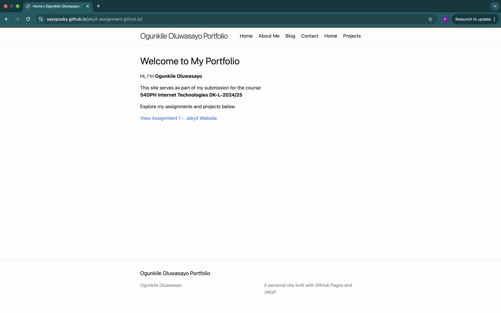
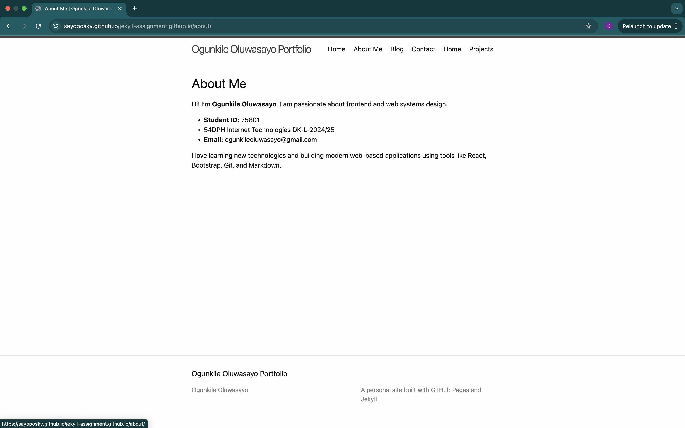
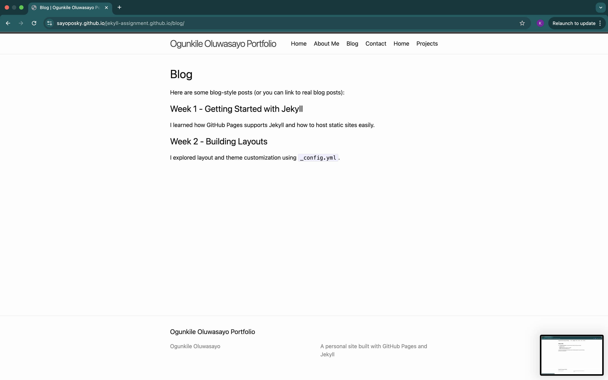
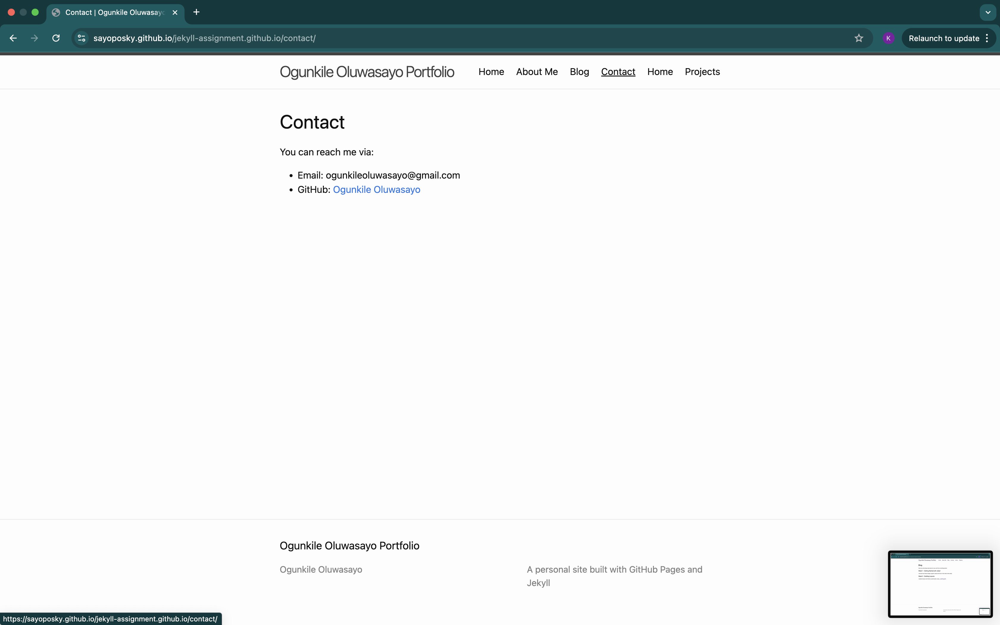
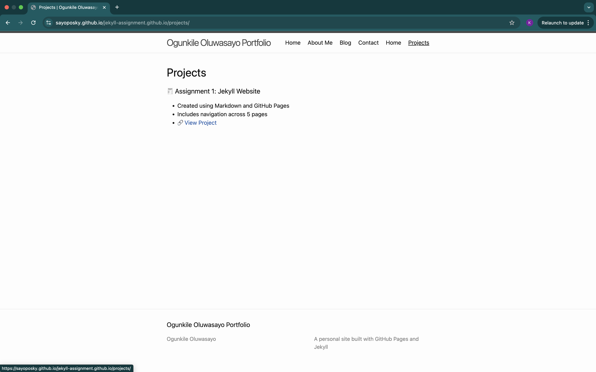

### Assignment 2  
## Reveal.js Presentation  
### Ogunkile Oluwasayo (75801)  
### 54DPH Internet Technologies DK-L-2024/25  

---

## Slide Overview  

- 👤 About Me  
- 💡 Interests  
- 🎯 Course Summary  
- 🔧 Skills Acquired  
- 💼 Project Highlights  
- 📘 Assignment 1  
- 🎤 Assignment 2  
- 📸 Screenshots  
- 🔗 Links  
- 🙏 Thank You  

---

## 👤 About Me  

- Name: **Ogunkile Oluwasayo**  
- Student ID: **75801**  
- Email: **ogunkileoluwasayo@gmail.com**  

---

## 💡 Interests  

- Web Development  
- Frontend Frameworks (React, Bootstrap)  
- Software Design  
- Git & GitHub Pages  

---

## 🎯 Course Summary  

This course introduced the core concepts of **Web Information Systems** and their real-world applications.

Key topics covered:

- Architecture of Web Systems  
- Client-Server Communication  
- React & Node.js Integration  
- GitHub Pages Deployment  

---

## 🔧 Skills Acquired  

- Building Static Sites with Jekyll  
- Hosting Projects with GitHub Pages  
- Creating Slide Decks using Reveal.js  
- Using Markdown + Themes for design  

---

## 💼 Project Highlights  

The following slides highlight the two major assignments completed during the course:

--  

### 📘 Assignment 1: Jekyll Website  

- Created a 5-page site using Markdown and Jekyll  
- Hosted on GitHub Pages  
- Includes Home, About, Blog, Projects, Contact pages  
- [🔗 View Site](https://sayoposky.github.io/jekyll-assignment.github.io/)

--  

### 🎤 Assignment 2: Reveal.js Presentation  

- Presentation written in Markdown  
- Solarized theme + custom structure  
- Slides include horizontal + vertical navigation  
- [🔗 View Slides](https://sayoposky.github.io/reveal-presentation)

---

## 📸 Screenshots from Assignment 1  

--  

### 🖥️ Homepage  

--  

### 🧑‍🎓 About Page  

--  

### 📚 Projects Page  

--  

### 📝 Blog Page  

--  

### 📞 Contact Page  

---

## 🔗 Links  

- 🌐 Website: [sayoposky.github.io/jekyll-assignment.github.io](https://sayoposky.github.io/jekyll-assignment.github.io)  
- 🖥️ Presentation: [sayoposky.github.io/reveal-presentation](https://sayoposky.github.io/reveal-presentation)  
- 💻 GitHub: [github.com/SayoPosky](https://github.com/SayoPosky)  
- 📧 Email: **ogunkileoluwasayo@gmail.com**

---

## 🙏 Thank You  

Thank you for viewing my presentation.  
I hope you found it informative and engaging!
